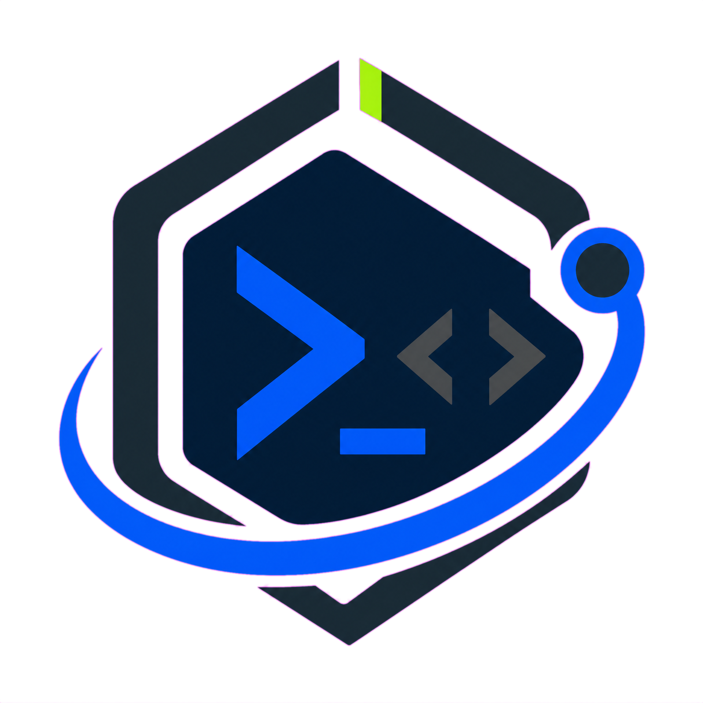
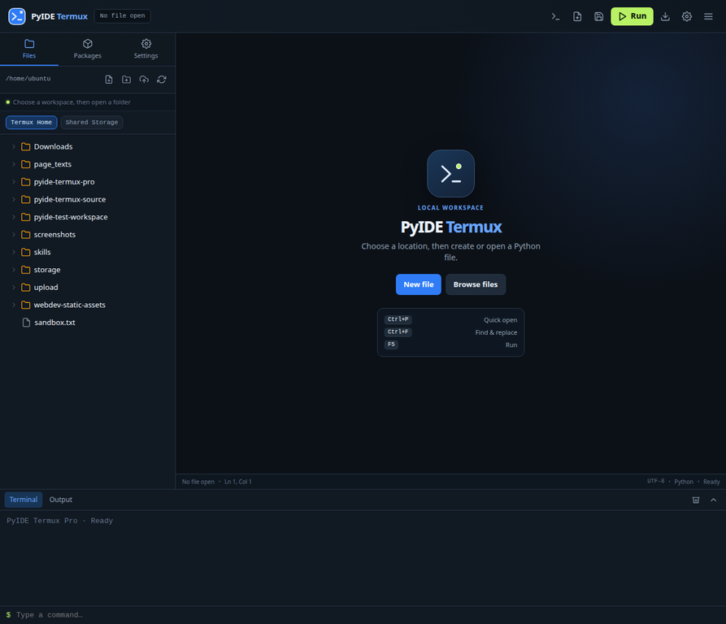

<div align="center">
  
  <h1>PyIDE Termux Pro</h1>
  <p><strong>A local, mobile-first Python IDE that runs inside Termux on Android.</strong></p>
  <p>
    <a href="https://github.com/craftultra000-png/PyIDE-Termux/actions/workflows/test.yml"></a>
    <a href="LICENSE"></a>
    
    
    
  </p>
  <p>
    <a href="#quick-start">Quick start</a> ·
    <a href="#features">Features</a> ·
    <a href="#architecture">Architecture</a> ·
    <a href="CONTRIBUTING.md">Contributing</a> ·
    <a href="SECURITY.md">Security</a>
  </p>
</div>



## Why PyIDE Termux Pro?

PyIDE Termux Pro brings a practical Python workspace to Android without assuming a laptop, cloud account, or permanent internet connection. It runs a local Python server from Termux and opens a responsive browser interface at `localhost:8080`. The workflow is designed around touch: choose a storage location visually, create files without typing paths, edit Python, run it, and inspect the output in one place.

> **العربية:** بيئة Python محلية للهاتف تعمل فوق Termux، مع مستعرض ملفات مرئي، اختيار مواقع بدون كتابة مسارات، محرر وتشغيل وواجهة RTL/LTR.

## Features

| Area | What is included |
|---|---|
| **Python workspace** | Syntax highlighting, line numbers, smart indentation, bracket completion, word wrap, configurable font size, autosave, and find/replace. |
| **File management** | Visual location picker, Termux Home and shared-storage roots, create, rename, move, copy, delete, upload, and download. |
| **Clean explorer** | Dot-prefixed files and folders are hidden by default; switching storage roots replaces the tree instead of stacking stale entries. |
| **Run and inspect** | Save-and-run with `F5`, stdout/stderr output, exit status, optional stdin, and an integrated terminal. |
| **Developer productivity** | Command palette, keyboard shortcuts, and package installation via `pip` or `pkg`. |
| **Global interface** | Arabic, English, Spanish, French, German, Turkish, Russian, and Hindi. UI direction changes automatically while code, paths, and output stay LTR. |
| **No heavy stack** | Python standard library server and browser-native ES modules; no Node.js, npm, or frontend build step is needed on Termux. |

## Quick start

### Install from Git and run with `pyide`

Open Termux on your Android phone and run these lines once:

```bash
pkg update -y
pkg install -y python git curl
git clone https://github.com/craftultra000-png/PyIDE-Termux.git ~/PyIDE-Termux
cd ~/PyIDE-Termux
bash scripts/install-termux.sh
```

After that, launch PyIDE at any time with one command:

```bash
pyide
```

`pyide` starts the local server only if it is not already running and stays active in Termux so you can stop it using **Ctrl+C**, just like `python server.py`. Open `http://127.0.0.1:8080` manually in your Android browser. Use `pyide --status` to check whether a server is already running.

The installer records the actual Git-clone folder automatically, so the command works whether you cloned the project as `~/PyIDE-Termux`, `~/pyide-termux`, or another directory name.

`termux-setup-storage` is optional, but it enables Android shared storage. The app remains usable with Termux Home when that permission has not been granted.

### Update from Git

When a newer version is available, update the repository and refresh the launcher:

```bash
cd ~/PyIDE-Termux
git pull --ff-only origin main
bash scripts/install-termux.sh
```

> **Note:** `pkg install pyide` requires a separately maintained Termux package repository or an accepted official Termux package. This project currently uses Git for installation and provides the same short runtime command: `pyide`.

## Interface highlights

| Visual file destinations | Clear workbench hierarchy |
|---|---|
| Creation dialogs use a folder browser with storage roots and nested folders instead of requiring raw path input. | The editor, contextual file drawer, and output panel are intentionally separated for small phone screens. |
| **Safe-by-default explorer** | **Accessible multilingual UI** |
| Dot entries are excluded from normal listings, and filesystem operations are constrained to allowed roots. | Interface direction is locale-aware without reversing code, terminal output, or filesystem paths. |

## Architecture

The project keeps its runtime light while separating responsibilities so contributors can test and extend it safely.

```text
browser UI (ES modules) ──────► local HTTP API ──────► Python handlers
        │                              │                    │
        ├── core/api.js                 ├── server.py        ├── file_handler.py
        ├── core/i18n.js                ├── config.py        ├── python_handler.py
        ├── core/path-utils.js                               ├── install_handler.py
        └── components/*                                     └── terminal_handler.py
```

| Path | Responsibility |
|---|---|
| [`static/js/app.js`](static/js/app.js) | Application coordinator, UI state, keyboard bindings, and feature workflows. |
| [`static/js/core/`](static/js/core) | Pure API, translation, and path utilities. |
| [`static/js/components/`](static/js/components) | Reusable visual modules: command palette and location picker. |
| [`handlers/`](handlers) | File operations, Python execution, package installation, and terminal behavior. |
| [`tests/`](tests) | No-dependency JavaScript and Python regression tests. |

Read the deeper module map in [`docs/ARCHITECTURE.md`](docs/ARCHITECTURE.md).

## Keyboard shortcuts

| Shortcut | Action |
|---|---|
| `Ctrl+S` | Save the current file. |
| `Ctrl+N` | Create a file. |
| `Ctrl+P` | Open the command palette. |
| `Ctrl+F` / `Ctrl+H` | Find / find and replace. |
| `F5` | Save and run the current file. |
| `Ctrl+I` | Toggle standard-input controls. |
| `Escape` | Close menus and dialogs. |

## Tests

The test suite covers filename and path helpers, translations, hidden-entry behavior, CRUD operations, and rejection of writes outside allowed roots.

```bash
bash tests/run-tests.sh
```

GitHub Actions runs the same suite on every push and pull request.

## Security model

This is a local development environment and should only be bound to a trusted device. The file handler resolves paths before operating on them and confines operations to configured roots. It also blocks access to sensitive operating-system prefixes. See [`SECURITY.md`](SECURITY.md) before reporting a vulnerability or extending command execution.

## Roadmap

The next valuable milestones are a Python debugger with breakpoints, diagnostics while typing, and project-wide search. Ideas and practical Android testing reports are welcome in [Issues](https://github.com/craftultra000-png/PyIDE-Termux/issues).

## Contributing

Contributions are welcome. Please read [`CONTRIBUTING.md`](CONTRIBUTING.md), keep changes focused, test them from Termux where possible, and preserve the mobile-first interaction model.

## License

Released under the [MIT License](LICENSE).
